<div align="center">

# ⚡ ResumeForge

### Build ATS-Friendly Resumes That Land Interviews

A powerful, free, open-source resume builder with real-time preview, 8 professional templates, intelligent ATS scoring, and pixel-perfect PDF/DOCX export.


[**Get Started**](#-getting-started) · [**Features**](#-features) · [**Templates**](#-8-professional-templates) · [**ATS Scoring**](#-intelligent-ats-scoring) · [**Screenshots**](#-screenshots)

</div>

---

## 📸 Screenshots

### Landing Page
<p align="center">
  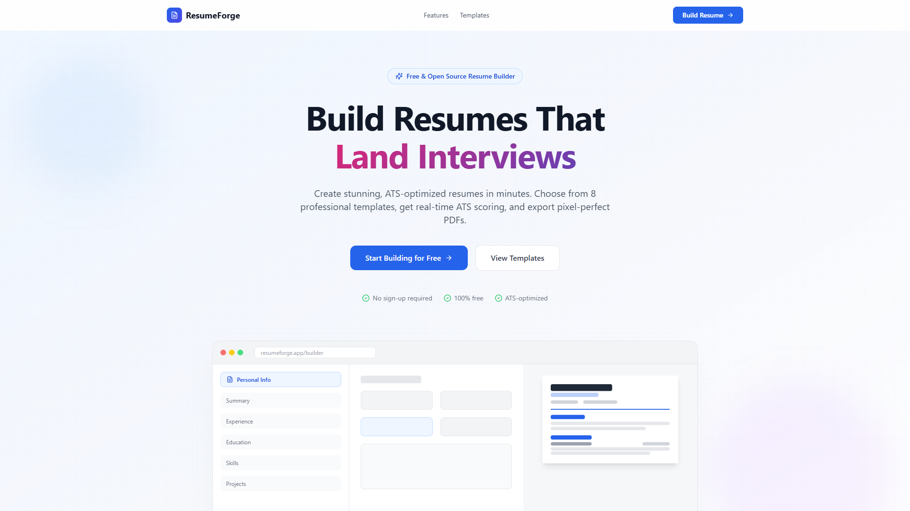
</p>

### Resume Builder — Content Editor
<p align="center">
  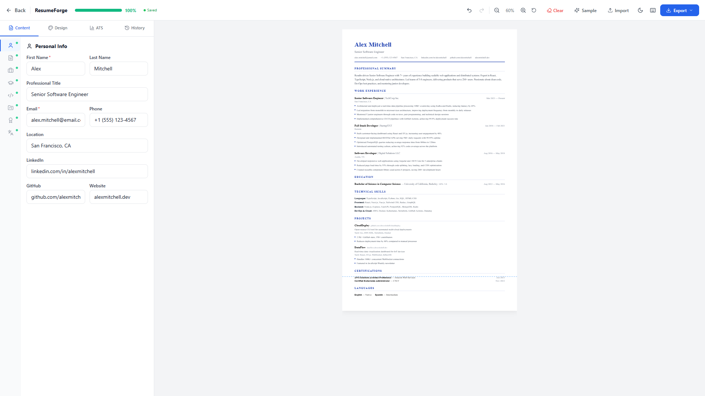
</p>

### Design Customization Panel
<p align="center">
  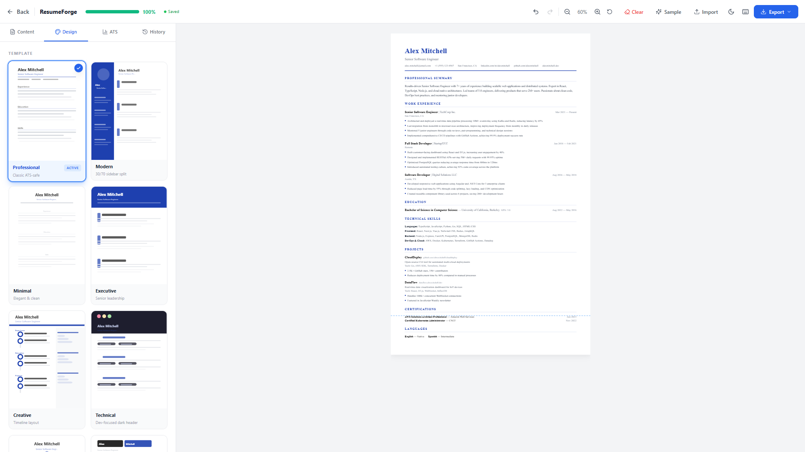
</p>

### Real-Time ATS Scoring
<p align="center">
  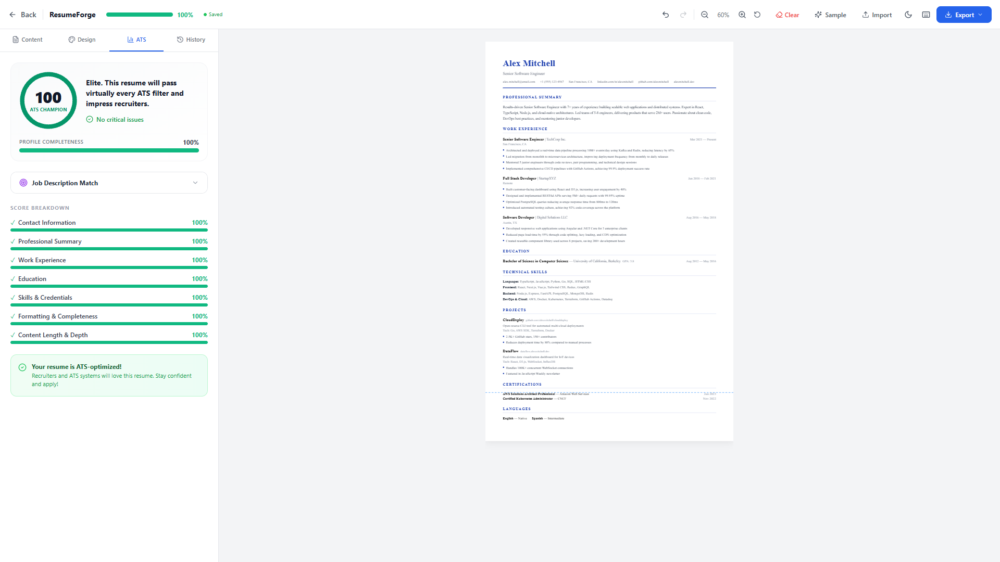
</p>

### Dark Mode
<p align="center">
  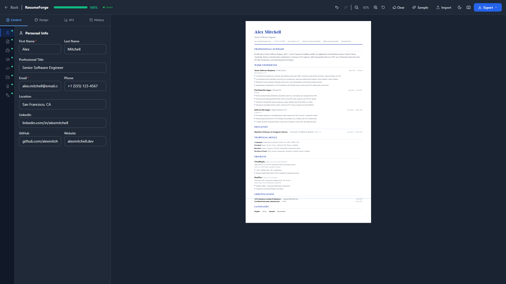
</p>

### Export Preview
<p align="center">
  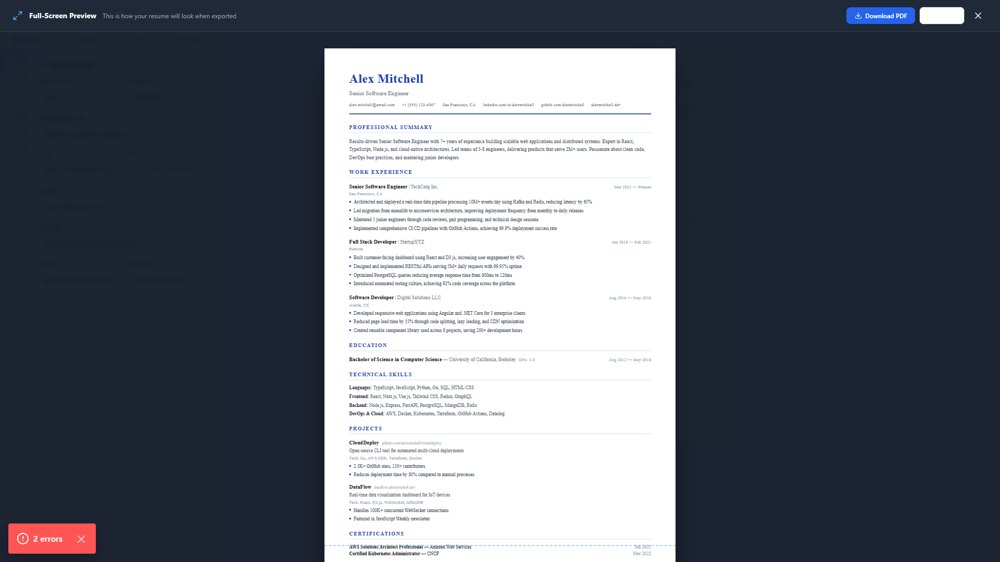
</p>

### Mobile Responsive
<p align="center">
  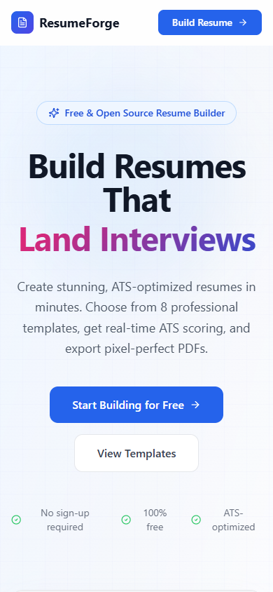
</p>

---

## 🎨 8 Professional Templates

Every template is fully customizable with 10 color themes, 10 font families, and extensive formatting controls.

<table>
  <tr>
    <td align="center" width="25%">
      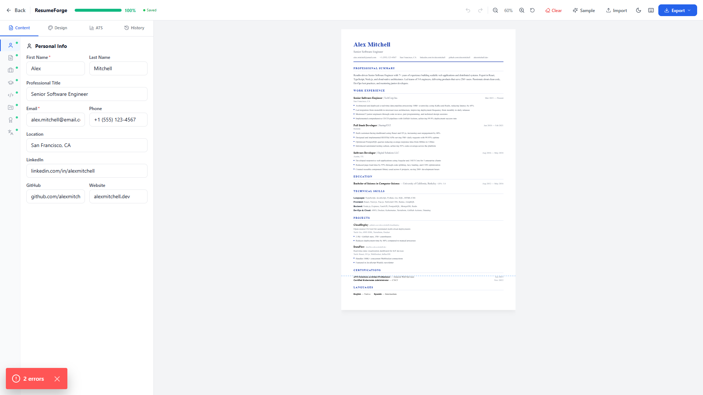<br/>
      <strong>Professional</strong><br/>
      <sub>Corporate · Finance · Law</sub>
    </td>
    <td align="center" width="25%">
      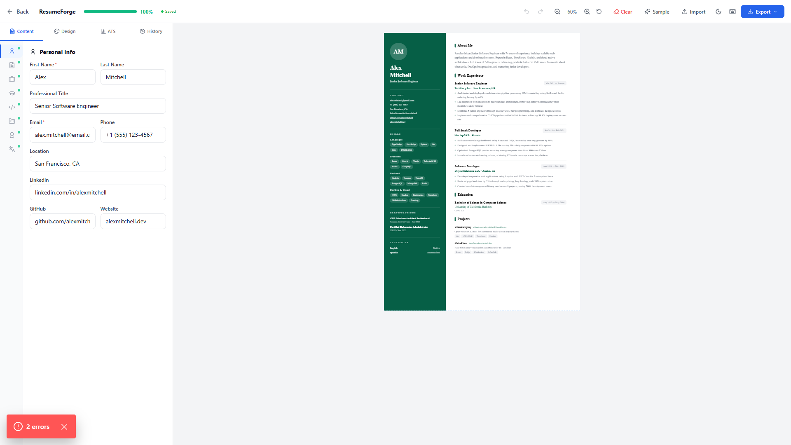<br/>
      <strong>Modern</strong><br/>
      <sub>Tech · Startups · Marketing</sub>
    </td>
    <td align="center" width="25%">
      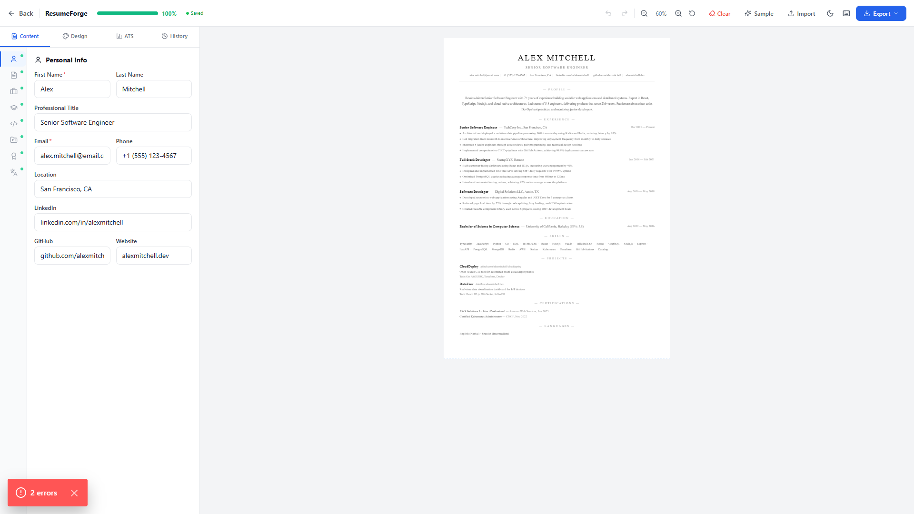<br/>
      <strong>Minimal</strong><br/>
      <sub>Universal · Clean</sub>
    </td>
    <td align="center" width="25%">
      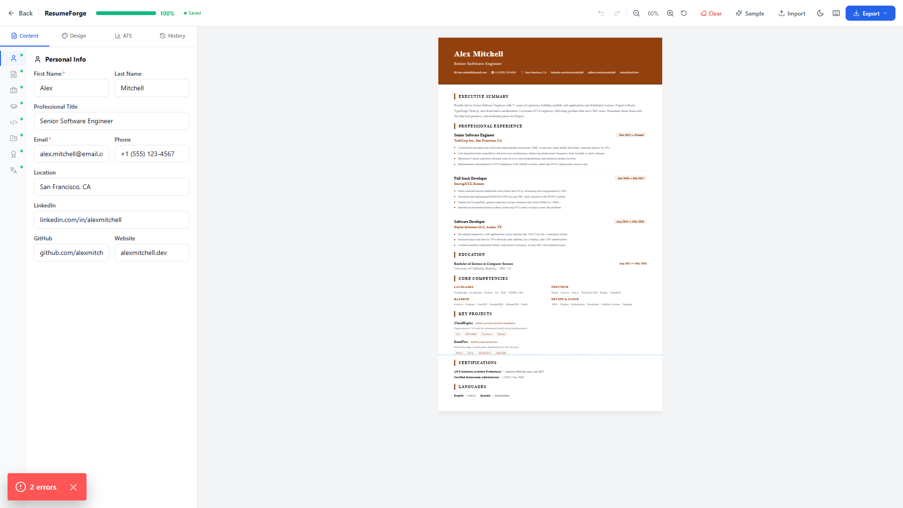<br/>
      <strong>Executive</strong><br/>
      <sub>C-Suite · Directors</sub>
    </td>
  </tr>
  <tr>
    <td align="center" width="25%">
      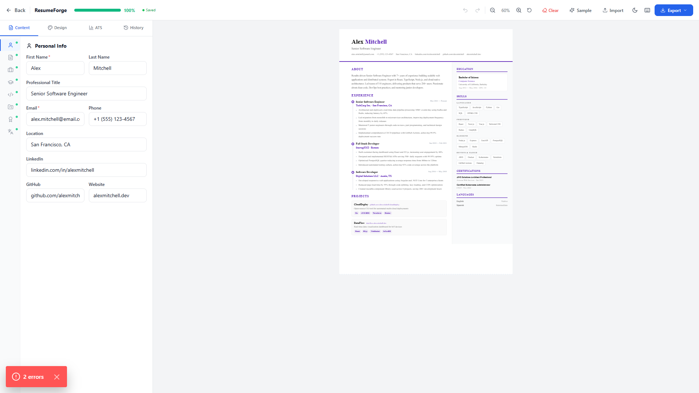<br/>
      <strong>Creative</strong><br/>
      <sub>Design · Media · Arts</sub>
    </td>
    <td align="center" width="25%">
      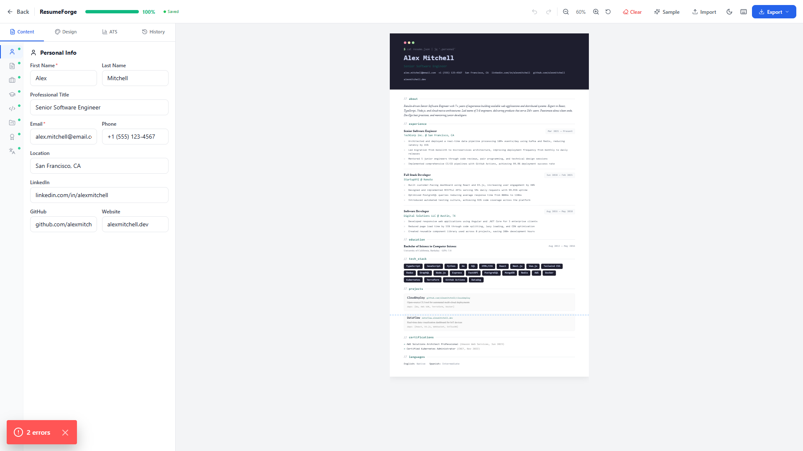<br/>
      <strong>Technical</strong><br/>
      <sub>SWE · DevOps · SRE</sub>
    </td>
    <td align="center" width="25%">
      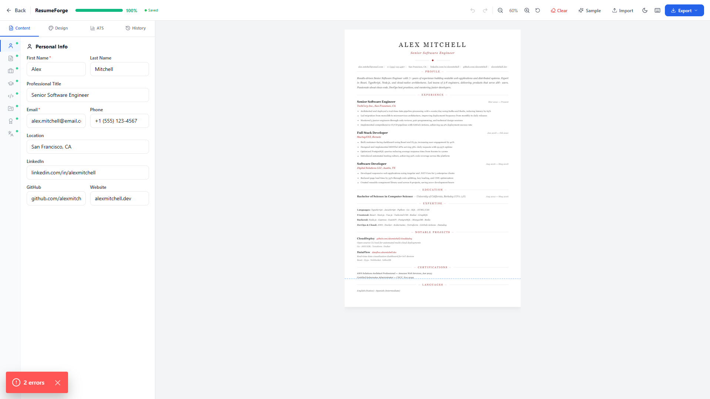<br/>
      <strong>Elegant</strong><br/>
      <sub>Consulting · Academia</sub>
    </td>
    <td align="center" width="25%">
      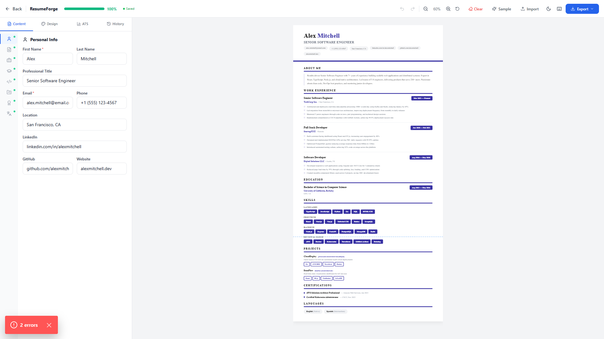<br/>
      <strong>Bold</strong><br/>
      <sub>Sales · Management</sub>
    </td>
  </tr>
</table>

---

## ✨ Features

### Core
- **8 Professional Templates** — Professional, Modern, Minimal, Executive, Creative, Technical, Elegant, and Bold
- **Real-Time ATS Scoring** — Instant feedback with section-by-section analysis and brutally honest actionable tips
- **Live Preview** — See changes reflected instantly as you type, with accurate page layout
- **Full-Screen Export Preview** — Preview exactly how your resume will look before downloading

### Export & Import
- **PDF Export** — High-quality PDF generation with optimized file size (JPEG compression)
- **DOCX Export** — Microsoft Word format with proper formatting, styles, and section structure
- **PDF/DOCX/TXT Import** — Parse existing resumes with intelligent section detection
- **JSON Import/Export** — Save and load complete resume data for backup or transfer

### Design Customization
- **10 Color Themes** — Royal Blue, Emerald, Crimson, Purple, Teal, Amber, Slate, Rose, Indigo, Classic Black + custom hex picker
- **10 Font Families** — Inter, Merriweather, Georgia, Helvetica, Times New Roman, Calibri, Lato, Roboto, Source Sans Pro, Playfair Display
- **8 Bullet Styles** — Circle, Dash, Triangle, Square, Diamond, Arrow, Star, None
- **Section Header Styles** — Uppercase Underline, Border Bottom, Accent Bar, Simple Bold
- **Skill Display Modes** — Comma-separated, Pills/Tags, Inline, Grouped
- **Page Layout Modes** — Auto, Single Page, Double, Triple
- **Fine-Grained Controls** — Line height, section spacing, margins (all 4 sides), letter spacing, name sizing, date alignment

### Productivity
- **Dark / Light Mode** — Full theme support with system preference detection
- **Keyboard Shortcuts** — Ctrl+Z undo, Ctrl+Y redo, Ctrl+S save, Ctrl+E export, and more
- **Undo / Redo** — Full edit history with snapshotting
- **Auto-Save** — Changes persist automatically to localStorage
- **Version History** — Name and save snapshots of your resume, restore any version
- **Drag-and-Drop Section Reorder** — Rearrange resume sections by dragging
- **Multiple Resumes** — Create and manage multiple resumes for different applications
- **Import from URL** — Paste a job listing URL to auto-extract job requirements

### Privacy
- **100% Client-Side** — All data stays in your browser, nothing is sent to any server
- **No Sign-Up Required** — Start building immediately
- **No Tracking** — Zero analytics, zero cookies, zero telemetry

---

## 📊 Intelligent ATS Scoring

ResumeForge includes a comprehensive ATS (Applicant Tracking System) scoring engine that analyzes your resume across 8 weighted dimensions:

| Section | Weight | What It Checks |
|---------|--------|----------------|
| **Contact Info** | 10 pts | Name, email, phone, location, LinkedIn, GitHub |
| **Summary** | 15 pts | Word count, action verbs, quantified metrics, conciseness |
| **Experience** | 30 pts | Bullet quality, metrics density, action verb variety, date completeness |
| **Education** | 10 pts | Degree, field of study, institution, GPA |
| **Skills** | 15 pts | Number of skills, categorization, variety |
| **Formatting** | 10 pts | Section completeness, structure |
| **Content Length** | 5 pts | Optimal word count for 1-page resumes |
| **Job Match** | 10 pts | Keyword overlap with pasted job description |

Tips are **brutally honest** — no sugarcoating. Each tip includes a specific fix.

---

## 📑 Sections Supported

1. **Personal Information** — Name, title, email, phone, location, LinkedIn, GitHub, website
2. **Professional Summary** — Customizable summary or objective statement
3. **Work Experience** — Multiple positions with bullet points, dates, and location
4. **Education** — Degree, field, institution, GPA, achievements
5. **Skills** — Categorized skill groups (e.g., Frontend, Backend, DevOps)
6. **Projects** — Name, description, technologies, URL, highlights
7. **Certifications** — Name, issuer, date, expiry
8. **Languages** — Language + proficiency level
9. **Awards & Honors** — Title, issuer, date, description
10. **Volunteering** — Role, organization, dates, description
11. **Publications** — Title, publisher, date, URL
12. **References** — Name, position, company, contact info

---

## 🛠 Tech Stack

| Layer | Technology |
|-------|------------|
| **Framework** | Next.js 14 (App Router) |
| **Language** | TypeScript 5.3 |
| **Styling** | Tailwind CSS 3.4 |
| **State** | Zustand 4.5 with localStorage persistence |
| **PDF Export** | html2canvas + jsPDF |
| **DOCX Export** | docx |
| **PDF Import** | pdfjs-dist 5.x |
| **DOCX Import** | mammoth |
| **Icons** | Lucide React |
| **Build** | Next.js compiler (SWC) |

---

## 🚀 Getting Started

### Prerequisites

- **Node.js 18+** ([download](https://nodejs.org/))
- npm, yarn, or pnpm

### Installation

```bash
# Clone the repository
git clone https://github.com/SanjaySundarMurthy/resumeforge.git
cd resumeforge

# Install dependencies
npm install

# Start development server
npm run dev
```

Open **http://localhost:3000** and start building your resume.

### Production Build

```bash
npm run build
npm start
```

---

## 📁 Project Structure

```
src/
├── app/
│   ├── layout.tsx              # Root layout with Google Fonts
│   ├── page.tsx                # Landing page with scroll animations
│   ├── globals.css             # Global styles, dark mode, animations
│   └── builder/
│       ├── page.tsx            # Main resume editor (content + preview)
│       └── loading.tsx         # Loading skeleton
├── components/
│   ├── ErrorBoundary.tsx       # Error boundary wrapper
│   ├── editor/
│   │   ├── SectionEditors.tsx  # All 12 section form editors
│   │   ├── DesignPanel.tsx     # Template, color, font, formatting controls
│   │   └── ATSScorePanel.tsx   # ATS score ring + section breakdown + tips
│   └── resume/
│       ├── ResumePreview.tsx   # Preview wrapper with zoom + page layout
│       ├── TemplateMiniPreview.tsx  # Thumbnail previews for template picker
│       └── templates/          # 8 resume template components
│           ├── ProfessionalTemplate.tsx
│           ├── ModernTemplate.tsx
│           ├── MinimalTemplate.tsx
│           ├── ExecutiveTemplate.tsx
│           ├── CreativeTemplate.tsx
│           ├── TechnicalTemplate.tsx
│           ├── ElegantTemplate.tsx
│           └── BoldTemplate.tsx
├── hooks/
│   ├── useAutoSave.ts          # Auto-save with debounce
│   ├── useDarkMode.ts          # Dark/light mode toggle
│   └── useKeyboardShortcuts.ts # Global keyboard shortcuts
├── store/
│   └── useResumeStore.ts       # Zustand store with persistence
├── types/
│   └── resume.ts               # TypeScript types, defaults, presets
└── lib/
    ├── utils.ts                # Utility functions (cn, ensureUrl, isLinkable)
    ├── ats-scorer.ts           # ATS scoring engine
    ├── pdf-generator.ts        # PDF/PNG export
    ├── docx-exporter.ts        # DOCX export
    └── resume-parser.ts        # PDF/DOCX/TXT resume import parser
```

---

## ⌨️ Keyboard Shortcuts

| Shortcut | Action |
|----------|--------|
| `Ctrl + Z` | Undo |
| `Ctrl + Y` | Redo |
| `Ctrl + S` | Save version |
| `Ctrl + E` | Export PDF |
| `Ctrl + D` | Toggle dark mode |
| `Ctrl + /` | Show shortcuts panel |

---

## 🤝 Contributing

Contributions are welcome! Please feel free to submit a Pull Request.

1. Fork the repository
2. Create your feature branch (`git checkout -b feature/amazing-feature`)
3. Commit your changes (`git commit -m 'Add amazing feature'`)
4. Push to the branch (`git push origin feature/amazing-feature`)
5. Open a Pull Request

---

## 👤 Author

**Sanjay Sundar Murthy**

- GitHub: [@SanjaySundarMurthy](https://github.com/SanjaySundarMurthy)
- Email: sanjaysundarmurthy@gmail.com

---

## 📄 License

MIT License — free for personal and commercial use. See [LICENSE](LICENSE) for details.

---

<div align="center">

**If you found ResumeForge useful, please consider giving it a ⭐**

Built with ❤️ using Next.js, TypeScript, and Tailwind CSS

</div>
